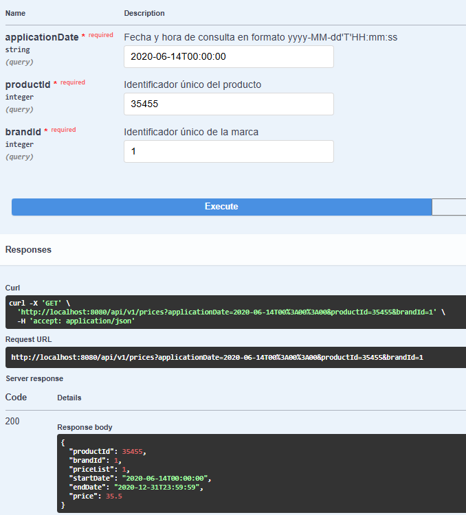
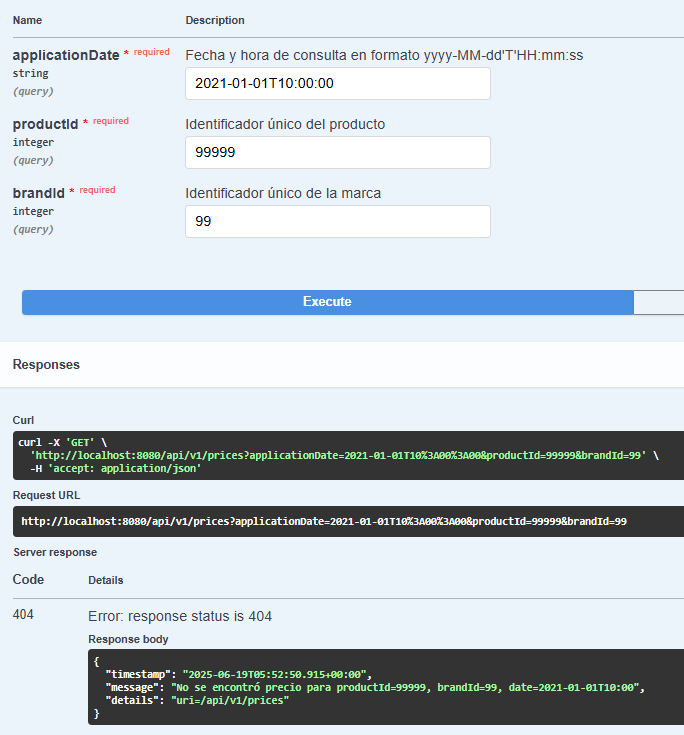
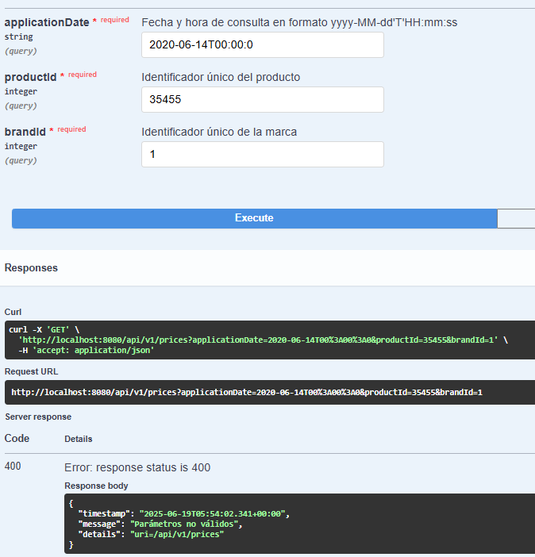
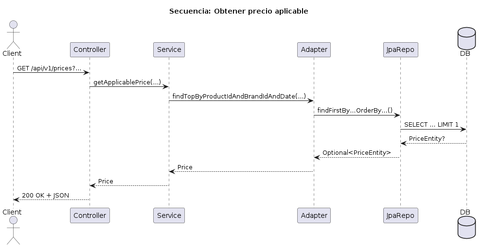

# Inditex Core Platform

## 1. Descripción general

Inditex Core Platform es un microservicio RESTful que devuelve el precio aplicable de un producto según marca y fecha/hora. Se basa en **arquitectura hexagonal (Ports & Adapters)** y **Domain‑Driven Design (DDD)** para mantener el núcleo de negocio independiente de frameworks.

**Puntos clave:**

- **API First:** Contrato OpenAPI 3.0 en `resources/static/openapi.yml`.
- **Capas desacopladas:** Dominio, aplicación e infraestructura.
- **Persistencia:** H2 en memoria con datos de ejemplo en `data.sql`.
- **Tests:** Unitarios, JPA y REST con cobertura completa del dominio.
- **CI/CD:** GitHub, JaCoCo y SonarCloud.

---

## 2. Stack tecnológico

| Categoría         | Tecnología / Versión                   |
| ----------------- | -------------------------------------- |
| Java              | 21                                     |
| Spring Boot       | 3.4.2                                  |
| ORM               | Spring Data JPA (Hibernate 6)          |
| Base de datos     | H2 (memoria)                           |
| Documentación     | Springdoc OpenAPI 2.5.0                |
| Mapeo             | PriceMapper (manual)                   |
| Testing           | JUnit 5, Mockito, Spring Test, MockMvc |
| Cobertura         | JaCoCo 0.8.10                          |
| CI/CD             | GitHub                         |
| Calidad de código | SonarCloud                             |
| Utilidades        | Lombok, Commons IO                     |

---

## 3. Arquitectura Hexagonal y DDD

```text
src/main/java/com/inditex/coreplatform
├─ application      # Casos de uso y servicios
│  └─ service       # PriceService, PriceServiceImpl
├─ domain           # Reglas de negocio y puertos
│  ├─ model         # Entidad Price pura (sin anotaciones JPA)
│  └─ repository    # Interfaz PriceRepositoryPort
├─ infrastructure   # Adaptadores y configuraciones
│  ├─ persistence
│  │  ├─ entity    # PriceEntity (JPA)
│  │  ├─ jpa       # SpringDataPriceEntityRepository
│  │  └─ adapter   # PriceRepositoryAdapter
│  ├─ rest
│  │  ├─ controller# PriceController
│  │  └─ exception # GlobalExceptionHandler, ErrorDetails
│  └─ config      # OpenApiConfig
└─ InditexApplication.java
```

**Por qué así:**

- **Independencia del dominio:** El paquete `domain/model` no nece­sita JPA.
- **Responsabilidad única:** Cada capa solo gestiona sus propias dependencias.
- **Flexibilidad:** Cambiar la base de datos o la API sin tocar la lógica de negocio.
- **Testabilidad:** Dominios puros facilitan tests rápidos y aislados.

---

## 4. Patrones y buenas prácticas

| Patrón / Práctica         | Descripción                                                     |
| ------------------------- | --------------------------------------------------------------- |
| Puertos y Adaptadores     | Interfases en dominio y traducción en adapters JPA o REST       |
| Query Derivation          | Métodos `findFirstBy…OrderBy…` aplican orden y `LIMIT 1` en SQL |
| Builder (`@Builder`)      | Creación clara de objetos complejos sin constructores largos    |
| @ControllerAdvice         | Respuestas de error uniformes con códigos 400, 404 y 500        |
| Inyección de dependencias | Beans gestionados por Spring sin new ni singletons manuales     |
| Clean Code & SOLID        | Clases de responsabilidad única, nombres descriptivos           |
| API First                 | OpenAPI como punto de partida para el desarrollo                |

---

## 5. Configuración y arranque

1. Clonar el repositorio:
   URL del repositorio: https://github.com/OmarHoyos12/inditex-core-platform
   ```bash
   git clone https://github.com/OmarHoyos12/inditex-core-platform.git
   cd inditex-core-platform/coreplatform
   ```
2. 	Abrir en IntelliJ IDEA:

- `	`Importar el proyecto en IntelliJ como proyecto Gradle.
- `	`Ejecutar el build inicial en terminal:

bash

./gradlew build

- `	`Ejecutar run  ubicando la clase InditexApplication.java, click derecho run, o ejecutando en terminal:

Ejecutar:
   ```bash
   ./gradlew bootRun
   ```
3. Acceder a:
    - **H2 Console:** `http://localhost:8080/h2-console`
        - JDBC URL: `jdbc:h2:mem:pricesdb`, username: sa
    - **Swagger UI:** `http://localhost:8080/swagger-ui.html`
    - **OpenAPI JSON:** `http://localhost:8080/openapi.json`

4. 	Ejecutar Pruebas Unitarias e Integración:

Ejecutar en terminal:
   ```bash
   ./gradlew bootTestRun
   ```

5.	Generar Reporte de Cobertura con Jacoco:
- `	`Run> Run 'InditexApplication' with Coverage. O desde terminal ejecutar:

```bash
   ./gradlew jacocoTestReport
   ```

- `	`Navegar a la ruta:
- `	`build/reports/jacoco/test/html/index.html
---

## 6. Testing y cobertura

- **Unitarios:** `PriceServiceImplTest` (Mockito sin `times(1)`).
- **Data JPA:** `SpringDataPriceEntityRepositoryTest` (con `@Sql` carga datos).
- **REST:** `PriceControllerTest` (MockMvc).
- **Context Load:** `InditexApplicationTests` valida beans.

**Cobertura JaCoCo:**

- `domain/model/Price.java`
- `application/service/PriceServiceImpl.java`
- Validaciones de error y rutas en REST

Reporte: `build/reports/jacocoHtml/index.html` con > 90% en toda la base.

---

## 7. Casos de prueba (Swagger & Postman)

- **Éxito (200)**:

  

- **404 Not Found**:

  

- **400 Bad Request**:

  

> Para probar los endpoints de este proyecto, importar la colección de Postman disponible en el archivo [PriceAPI.postman_collection.json](PriceAPI.postman_collection.json) ubicado en la raíz del repositorio.

### Cómo Importar
1. Abre Postman.
2. Ve a **File > Import**.
3. Selecciona el archivo `PriceAPI.postman_collection.json`.

---

## 8. Diagrama de secuencia



---

## 9. CI/CD y calidad de código

- **GitHub Actions:** Automatiza build, tests, reporte de cobertura (JaCoCo) y análisis con SonarCloud.
- **SonarCloud:** Pasó el Quality Gate (sin fallos críticos).
- **Flujo de ramas:** `feature/*` → `develop` → `release` → `main`.

## 10. Consideraciones finales

- Cumplimos **API First** con OpenAPI.
- Arquitectura hexagonal + DDD implementados.
- Consultas eficien­tes: orden y `LIMIT 1` en BD.
- Errores controlados con `@ControllerAdvice`.
- Tests e integración cubren todos los escenarios.


